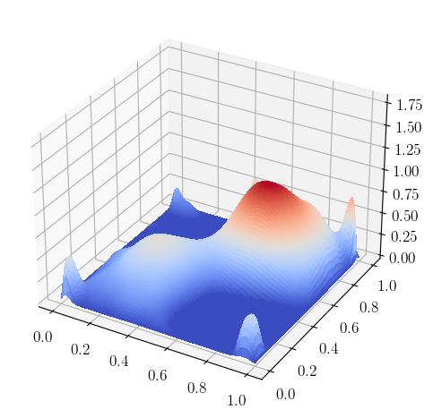

# Risk-neutral bilinear PDE-constrained optimization

The code provided here is used to produce the numerical illustrations in the manuscript

> J. Milz: Consistency of Sample-Based Critical Points for Risk-Neutral PDE-Constrained Optimization, preprint, , 2022.

The numerical simulations are performed for the risk-neutral bilinear PDE-constrained optimization problem

$$
\min_{u\in U_{\text{ad}}} \mathbb{E}[J(S(u,\xi))]  + (\alpha/2) \\|u\\|_{L^2(D)}^2,
$$

where $\alpha > 0$ is a regularization parameter, $D = (0,1)^2$ is the computational domain, $U_{\text{ad}} = \\{ u \in L^2(D) \colon 0 \leq u \leq \text{ub}\\}$ is the feasible set and
$\text{ub}$ is a nonnegative, essentially bounded function, $J(y) = (1/2) \\|y-y_d\\|\_{L^2(D)}^2$ 
is the integrand, and for each $(u,\xi) \in U_{\text{ad}} \times \Xi$, 
$S(u,\xi)$ is the solution to the bilinear state equation: find $y \in H_0^1(D)$ such that

$$
\int_{D} \kappa(x,\xi) \nabla y(x)^T v(x) \text{d} x + \int_{D} g(x,\xi) u(x) y(x) v(x) \text{d}  x = \int_{D} b(x,\xi) v(x) \text{d} x \quad \text{for all} \quad v \in H_0^1(D).
$$

Here, $\kappa(x,\xi) > 0$ 
and $g(x,\xi) \geq 0$ 
for all $x \in \bar{D} \times \Xi$. 
The random field $\kappa$ is implemented in [random_diffusion_coefficient.py](random_fields/random_diffusion_coefficient.py) and the implementation of $g$ can be found in [random_nonnegative_coefficient.py](random_fields/random_nonnegative_coefficient.py). 

We define the reduced parameterized objective function $\widehat{J}$ by

$$
	\widehat{J}(u,\xi) = J(S(u,\xi)).
$$

The bilinear control problem is implemented in [random_bilinear_problem.py](random_bilinear_problem.py).

## Random inputs

We chose the diffusion coefficient $\kappa(x,\xi) = \exp(a(x,\xi))$, where $a$ is the truncated KL expansion defined in eq. (9.50) in [[1]](#1) with correlation length $\ell = 0.15$, zero mean field, and $200$ independent 
$[-\\sqrt{3},\\sqrt{3}]$ uniform random variables. The random field $g$ is defined by $g(x,\xi) = \\max\\{0, 2r(x,\xi)\\}$, where $r$ is as $a$, but with mean field $1$ and defined by another set of $200$
independent random variables. We further chose $b(x,\xi) = -1$.

### Samples of random inputs

The following animations show several realizations of the random fields $\kappa$ and $g$. 

The animation can be generated using [plot_random_fields.sh](random_fields/plot_random_fields.sh).

## Nominal problem

The nominal problem 

$$\min_{u \in U_{\text{ad}}} \widehat{J}(u,\mathbb{E}[\xi])$$ 

can be solved using [nominal_problem.py](nominal_problem.py) and [simulate_nominal.sh](simulate_nominal.sh). After running [nominal_problem.py](nominal_problem.py), the script [simulate_nominal.sh](simulate_nominal.sh) calls [certify_nominal.py](certify_nominal.py) to "certify" the nominal solution via [certify_nominal.py](certify_nominal.py). Here certifying means, we check whether the computed solution actually satisfies a first-order optimality condition, called criticality measure. The following figures depicts a critical point of the nominal problem.

|  |
|:--:| 
| Critical point of nominal problem. |

## Reference problem

We refer to an SAA problem defined by a large number of samples as a reference problem.

The following figure depicts a critical point of the reference problem computed with sample size $N=500$. This critical point can either be computed using [test_simulate_reference.sh](test_simulate_reference.sh) or using an adaption of [simulate_dependent.sh](simulate_dependent.sh).

|  |
|:--:| 
| Critical point of reference problem. |

## Realizations of SAA critical points

The following figure depicts SAA critical points with sample size $N=10$ (left) and $N=100$ (right) computed with the same random sample.

 
 

## Dependencies

The dependencies are listed in [environment.yml](../../environment.yml). To generate [surface plots](https://matplotlib.org/stable/gallery/mplot3d/surface3d.html) using [matplotlib](https://matplotlib.org/), we recommend to follow the approach described on p. 137 in

> H. P. Langtangen, A. Logg: [Solving PDEs in Python: The FEniCS Tutorial I](https://link.springer.com/book/10.1007/978-3-319-52462-7), Springer, Cham, 2016

We use [surface_function.py](../../stats/surface_function.py) to generate surface plots. The code depends on [boxfield.py](https://github.com/hplgit/fenics-tutorial/blob/master/src/vol1/python/boxfield.py). The code [update_boxfield.sh](../../stats/update_boxfield.sh) may be used to download [boxfield.py](https://github.com/hplgit/fenics-tutorial/blob/master/src/vol1/python/boxfield.py) and to update boxfield.py.

## References
<a id="1">[1]</a> 
G. J. Lord, C. E. Powell, and T. Shardlow, [An Introduction to Computational Stochastic PDEs](https://doi.org/10.1017/CBO9781139017329), Cambridge Texts Appl. Math. 50, Cambridge University Press, Cambridge, 2014.

