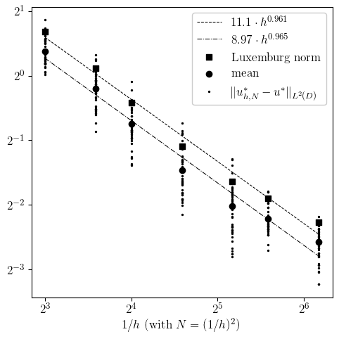

# Reliable Error Estimates for Optimal Control of Linear Elliptic PDEs with Random Inputs

The code provided here is used to produce the numerical illustrations in the manuscript

> J. Milz: Reliable Error Estimates for Optimal Control of Linear Elliptic PDEs with Random Inputs, preprint, , 2022.

The main purpose of the simulations is to verify the empirical convergence of solutions to the discretized sample average approximation (SAA) problem 

$$
\min_{u_h \in U_{\text{ad},h}} \frac{1}{2N} \sum_{i=1}^N \\|S_h(u_h,\xi^i)-y_{d,h}\\|\_{L^2(D)}^2 + (\alpha/2)\\|u_h\\|\_{L^2(D)}^2 + \beta \\|u_h\\|\_{L^1(D)},
$$

towards that of the risk-neutral linear elliptic PDE-constrained optimization problem

$$
\min_{u \in U_{\text{ad}}} (1/2) \mathbb{E}[ \\|S(u,\xi)-y_d\\|\_{L^2(D)}^2 ]  + (\alpha/2)\\|u\\|\_{L^2(D)}^2  + \beta \\|u\\|\_{L^1(D)},
$$

where 
$\alpha = 10^{-3}$ 
and 
$\beta = 10^{-2}$ 
are regularization parameters, 
$D = (0,1)^2$ is the computational domain, and
$U\_{\text{ad}} = \\{ u \in L^2(D) \colon -6 \leq u \leq 6\\}$ is the feasible set. Moreover, each $(u,\xi) \in L^2(D) \times [-1,1]^4$, $S(u,\xi)$ is the solution to the parameterized linear elliptic partial differential equation: find $y \in H_0^1(D)$ such that

$$
\int_{D} \kappa(x,\xi) \nabla y(x)^T v(x) \text{d} x = \int_{D} u(x) v(x) \text{d} x \quad \text{for all} \quad v \in H_0^1(D).
$$

Here, the random diffusion coefficient $\kappa : [0,1]^2 \times [-1,1]^4 \to (0,\infty)$ is defined by

$$
\kappa(x,\xi) = \exp\big(\xi_1 \cos(1.1\pi x_1) +\xi_2 \cos(1.2\pi x_1) + \xi_3 \sin(1.3\pi x_2) +\xi_4 \sin(1.4\pi x_2)\big).
$$

The control space $L^2(D)$ is approximated using piecewise constant finite elements (DG0) and the state space 
$H_0^1(D)$ using piecewise linear continuous finite elements (CG1). Let us denote the discretized control space by $U_h$ and the discretized state space by $Y_h$, indexed by the mesh width $h > 0$. We define 
$U_{\text{ad},h} = U_{\text{ad}} \cap U_h$ and $y_{d,h}$ as the projection of $y\_d$ onto 
$U_h$. 


The vectors 
$\xi^1, \xi^2, \ldots$ 
are independent identically distributed random vectors, each having the same distribution of 
$\xi$. 
The distribution of 
$\xi$ 
is a uniform distribution constructed using a equidistant discretization of the interval 
$[-1,1]$ 
with 
$12$ points. 


For each $(u_h,\xi) \in U\_h \times [-1,1]\^4$, $S\_h(u\_h,\xi)$ is the solution to the discretized linear elliptic partial differential equation: find $y\_h \in Y\_h$ such that

$$
\int_{D} \kappa_h(x,\xi) \nabla y_h(x)^T v_h(x) \text{d} x = \int_{D} u_h(x) v_h(x) \text{d} x \quad \text{for all} \quad v_h \in Y_h,
$$

where $\kappa_h \approx \kappa$.

For solutions $u\_{h,N}^\*$ to the discretized SAA problem and the solution $u^\*$ to the risk-neutral problem, we are interested in verifying convergence rates for statistics applied to the random errors

$$
	\\|u_{h,N}^\*-u^\*\\|\_{L^2(D)}
$$

as a function of the mesh width $h > 0$ and the sample size $N \in \mathbb N$. As statistics, we chose the [Luxemburg norm](https://en.wikipedia.org/wiki/Orlicz_space) with Young's function $\exp(x^2)-1$ and the mean.

The linear elliptic control problem is implemented in [random_linear_problem.py](random_linear_problem.py) and the random diffusion cofficient is implemented in [random diffusion coefficient](mknrandom_field.py).

## Convergence rates

The following figure depicts the convergence rates as $1/h$ and $N$ increase. The theoretical convergence rate is $1$.



The figure can be generated using [plot_experiment.sh](plot_experiment.sh). The Luxemburg norm is implemented in [luxemburg_norm.py](../../stats/luxemburg_norm.py).

## Reference solution

Since the solution to the infinite-dimensional risk-neutral linear elliptic PDE-constrained optimization problem is unavailable, we chose an SAA solution $u^\* = u_{h^\*,N^\*}^\*$ with $h^\* = 1/144$ and $N^\* = 144^2$ as a reference solution. Using [simulate_reference.sh](simulate_reference.sh), this solution can be computed. The reference solution can be plotted using [plot_reference_control.sh](plot_reference_control.sh). 

The code [certify_reference.py](certify_reference.py) is used to check optimality of the reference solution based on an estimate established in [termination_criteria.md](termination_criteria/termination_criteria.md).

## Further illustrations

### Realization of random diffusion coefficient

The following animation shows several realizations of the random diffusion coefficient $\kappa$.


The code used to generate the gif is located in [illustrations/random_field](illustrations/random_field). The gif can be generated by executing [plot_random_field.sh](illustrations/random_field/plot_random_field.sh).

### Convergence of SAA solutions

The following animation illustrates the convergence of an SAA solution's realization as the mesh width decreases and the sample size increases.


The code used to generate the gif is located in [illustrations/convergence](illustrations/convergence). After adapting and running the script [simulate_solution.sh](illustrations/convergence/simulate_solution.sh), the script [plot_convergence.sh](illustrations/convergence/plot_convergence.sh) can be used to generate the gif. 

### Realizations of SAA solutions

The following animation shows several independent SAA solutions for fixed a mesh width and a fixed sample size.


The code used to generate the gif is located in [illustrations/realizations](illustrations/realizations). After running the script [simulate_dependent.sh](illustrations/realizations/simulate_dependent.sh), the script [plot_dependent.sh](illustrations/realizations/plot_dependent.sh) can be used to generate the gif. 

## Dependencies

To create a conda environment, you can use the following commands.

```
conda env create -f environment.yml
conda activate saa4pde

cd saa4pde

conda deactivate saa4pde
```

### Generating surface plots

To generate [surface plots](https://matplotlib.org/stable/gallery/mplot3d/surface3d.html) using [matplotlib](https://matplotlib.org/), we recommend to follow the approach described on p. 137 in

> H. P. Langtangen, A. Logg: [Solving PDEs in Python: The FEniCS Tutorial I](https://link.springer.com/book/10.1007/978-3-319-52462-7), Springer, Cham, 2016

The computer code [boxfield.py](https://github.com/hplgit/fenics-tutorial/blob/master/src/vol1/python/boxfield.py) is available at https://github.com/hplgit/fenics-tutorial/blob/master/src/vol1/python/boxfield.py. The following changes to boxfield.py must be made in order for the code to work:

- The print statements must be updated. Change `print TEXT` to `print(TEXT)`. 
- The interpolation code
```
fenics_function \
               = interpolate(u, FunctionSpace(fenics_mesh, 'P', 1))
```
can be updated via, for example, 
```
U = fenics.FunctionSpace(fenics_mesh, "P", 1)
u = fenics.Function(U)
u.interpolate(fenics_function)
fenics_function  = u
```
- The text `.array()` must be replaced by `.get_local()`. For example, 
`nodal_values = fenics_function.vector().array().copy()` becomes `nodal_values = fenics_function.vector().get_local().copy()` and `nodal_values[d2v] = fenics_function.vector().array().copy()` becomes `nodal_values[d2v] = fenics_function.vector().get_local().copy()`

