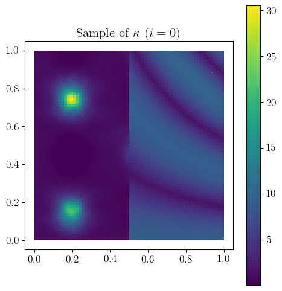
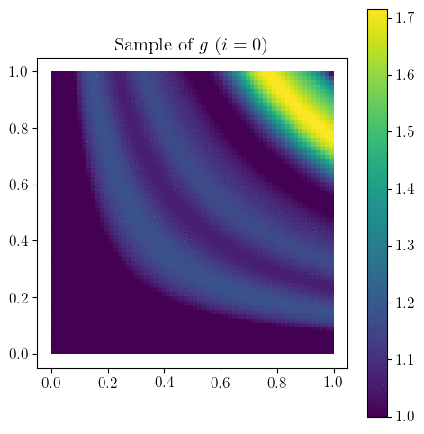
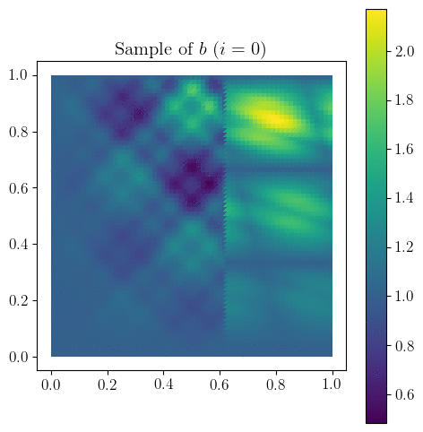
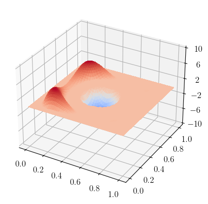
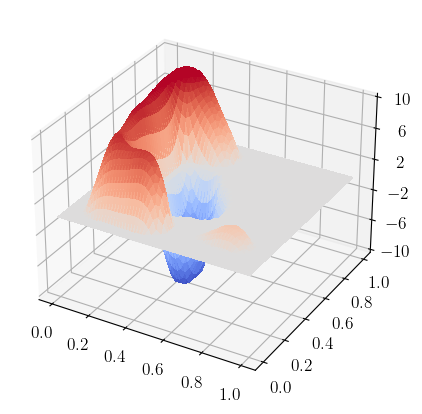

# Sample size estimates for risk-neutral semilinear PDE-constrained optimization

The code provided here was used to produce the numerical illustrations in the manuscript

> J. Milz and M. Ulbrich: Sample Size Estimates for Risk-Neutral Semilinear PDE-Constrained Optimization, preprint, , 2022.

The code was used to perform simulations for the risk-neutral semilinear PDE-constrained optimization problem

$$
\min_{u\in U_{\text{ad}}} (1/2)\mathbb{E}[\\|S(u,\xi)-y_d\\|\_{L^2(D)}^2]  + (\alpha/2) \\|u\\|\_{L^2(D)}^2 + \gamma \\|u\\|\_{L^1(D)}
$$

where $\alpha > 0$ and 
$\gamma \geq 0$ are regularization parameter, 
$D = (0,1)^2$ is the computational domain, 
$U_{\text{ad}} = \\{ u \in L^2(D) \colon a \leq u \leq b\\}$ is the feasible set and 
$a$ and 
$b$ are fixed numbers, 
$y_d \in L^2(D)$, and for each 
$(u,\xi) \in U\_{\text{ad}} \times \Xi$, 
$y(\xi) = S(u,\xi) \in H_0^1(D)$ solves

$$
\int_{D} \kappa(x,\xi) \nabla y(x)^T \nabla v(x) \text{d} x +  \int_{D} y(x)^3 v(x) \text{d} x = \int_{D} g(x,\xi) u(x) v(x) \text{d}  x + \int_{D} b(x,\xi) v(x) \text{d} x \quad \text{for all} \quad v \in H_0^1(D).
$$

Here, $\kappa(x,\xi) > 0$,
$g(x,\xi) \in \mathbb{R}$,
and $b(x,\xi) \in \mathbb{R}$
for all $x \in \bar{D} \times \Xi$. 
The random field $\kappa$ is implemented in [random_diffusion_coefficient.py](random_fields/random_diffusion_coefficient.py), and the implementation of $g$ can be found in [random_control_coefficient.py](random_fields/random_control_coefficient.py) and that of [random_righthand_side.py](random_fields/random_righthand_side.py).

## Samples of random inputs

The following animations show several realizations of the random fields 
$\kappa$, 
$g$, and 
$b$.

The animation can be generated using [plot_random_fields.sh](random_fields/plot_random_fields.sh).

## Nominal and reference solutions

For $\alpha = 0.001$, the nominal critical point (left) and reference critical point (right). The nominal critical point is a critical point of 

$$
\min_{u\in U_{\text{ad}}} (1/2)\\|S(u,\mathbb{E}[\xi])-y_d\\|\_{L^2(D)}^2  + (\alpha/2) \\|u\\|\_{L^2(D)}^2 + \gamma \\|u\\|\_{L^1(D)}.
$$

The reference critical point is a critical point of an SAA problem computed with a high number of samples (here $2^{13}$).

## Dependencies

The dependencies are listed in [environment.yml](../../environment.yml). To generate [surface plots](https://matplotlib.org/stable/gallery/mplot3d/surface3d.html) using [matplotlib](https://matplotlib.org/), we recommend to follow the approach described on p. 137 in

> H. P. Langtangen, A. Logg: [Solving PDEs in Python: The FEniCS Tutorial I](https://link.springer.com/book/10.1007/978-3-319-52462-7), Springer, Cham, 2016

We use [surface_function.py](../../stats/surface_function.py) to generate surface plots. The code depends on [boxfield.py](https://github.com/hplgit/fenics-tutorial/blob/master/src/vol1/python/boxfield.py). The code [update_boxfield.sh](../../stats/update_boxfield.sh) may be used to download [boxfield.py](https://github.com/hplgit/fenics-tutorial/blob/master/src/vol1/python/boxfield.py) and to update boxfield.py.
