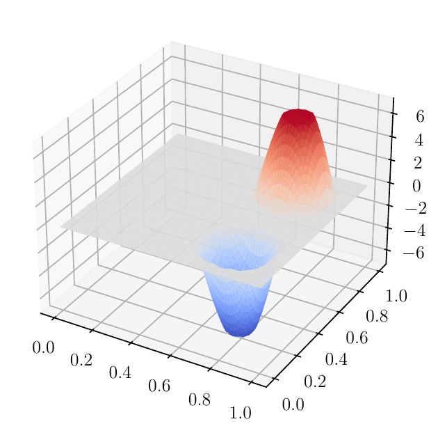
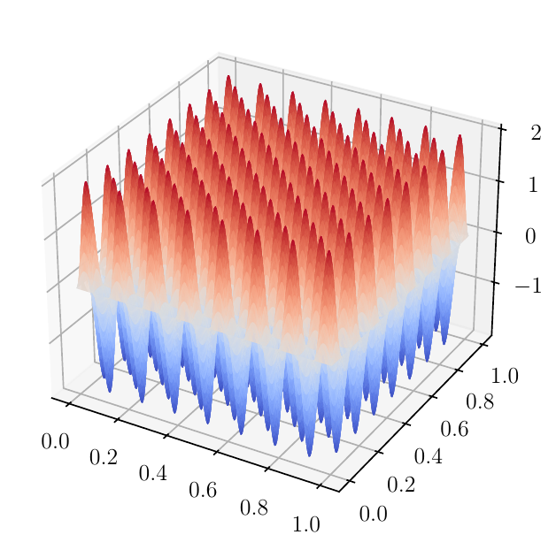

# Consistency of Monte Carlo Estimators for Risk-Neutral PDE-Constrained Optimization

The code in this directory has been used to generate the numerical illustrations in the manuscript

> J. Milz, Consistency of Monte Carlo Estimators for Risk-Neutral PDE-Constrained Optimization, preprint, , 2022

## Illustrations

|  | 
|:--:| 
| SAA solution with sample size 1000.|

The SAA solution can be computed using [simulate.py](simulate.py). The current implementation supports serial computations only.  The optimization problem is implemented in [semilinear_random.py](semilinear_random.py). The random field is implemented in [random_field.py](random_field.py). Realizations of the random field can be generated using [plot_random_field.py](plot_random_field.py).

|  | 
|:--:| 
| Feasible but oscillatory function.|

We used [noncompact_demo.py](noncompact_demo.py) to plot oscillatory functions.

## Dependencies

The dependencies are listed in [environment.yml](../../environment.yml). To generate [surface plots](https://matplotlib.org/stable/gallery/mplot3d/surface3d.html) using [matplotlib](https://matplotlib.org/), we used the approach described on p. 137 in

> H. P. Langtangen, A. Logg: [Solving PDEs in Python: The FEniCS Tutorial I](https://link.springer.com/book/10.1007/978-3-319-52462-7), Springer, Cham, 2016
